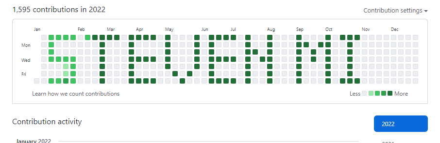

# Github Contribution Text Drawer



Python script for writing text on Github contribution chart.

## Requirements

- Python 3.X

## Getting Started

1. Create repository
2. Put `main.py` into repository
3. Modify `TEXT` in `main.py`.
    - Supported characters: `a, b, c, ..., x, y, z`, `,`(dot), ` `(space)
    - Maximum number of characters: 10
4. Modify `MIN_CONTRIB` to the largest number of contribution in 2021 or expected contributions in 2022.

5. Install dependencies
    ```commandline
    pip install -r requirements.txt
    ```

6. Run script. This will create git commits locally
    ```commandline
    python main.py
    ```

7. Push commits to Github
    ```commandline
    git push origin main
    ```

## License

Apache License Version 2.0, see [LICENSE](LICENSE)